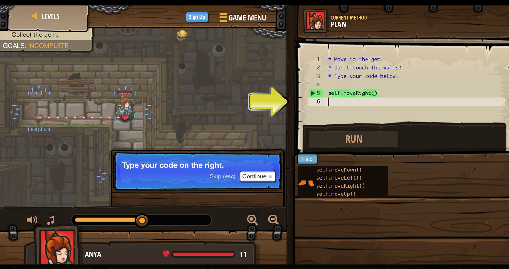
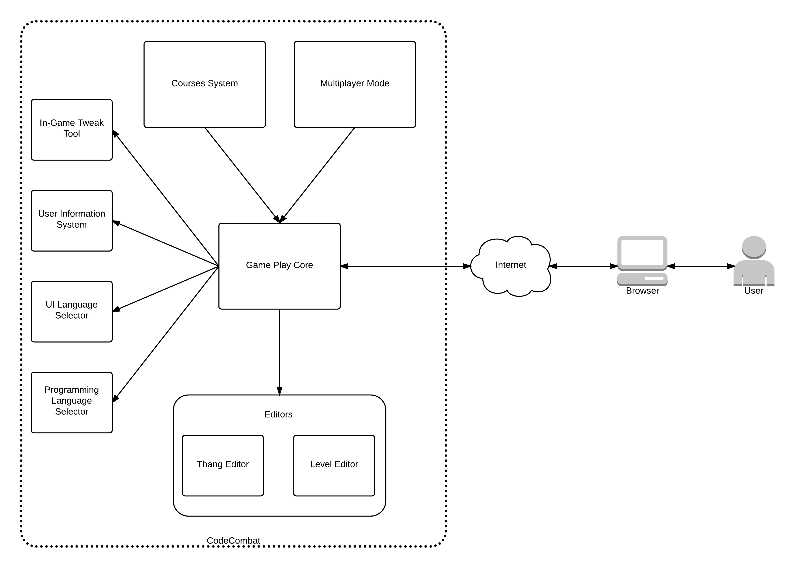
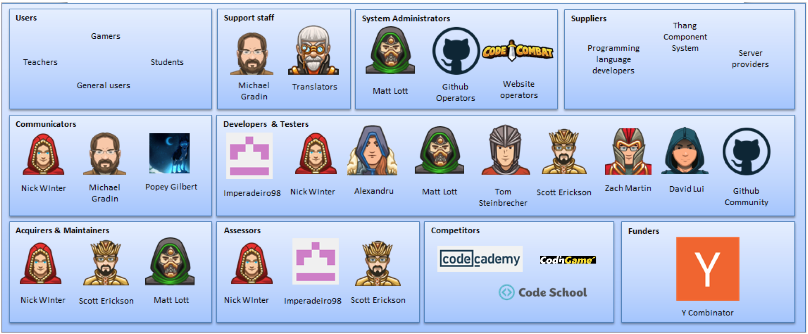
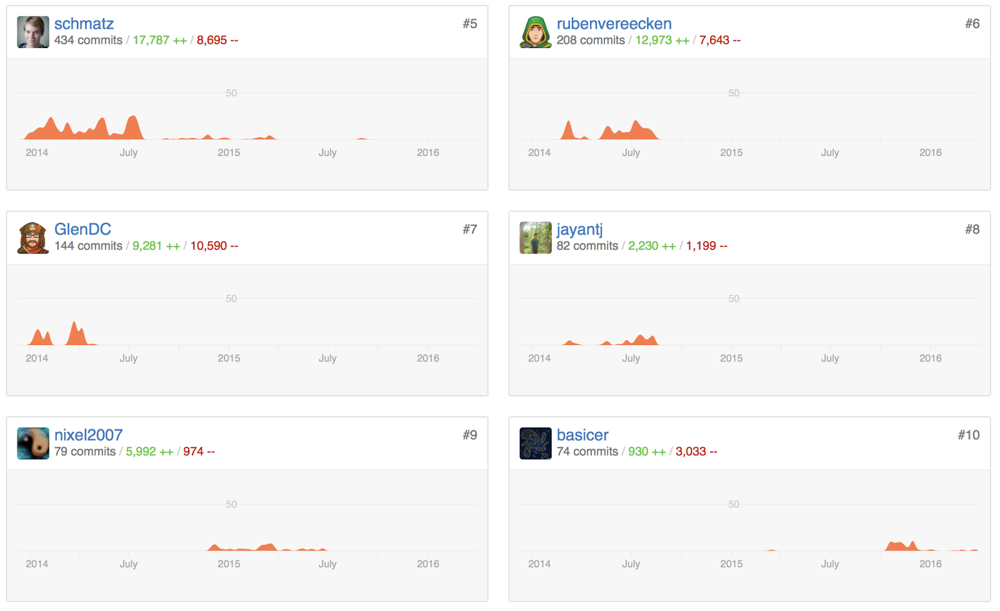
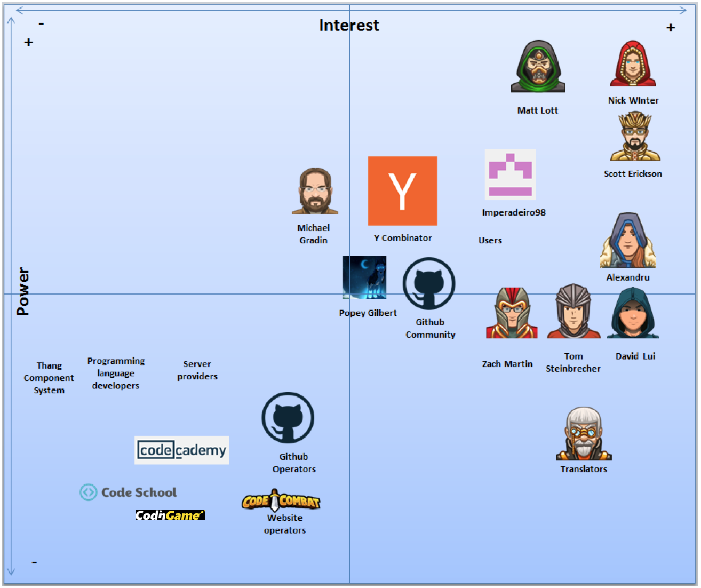
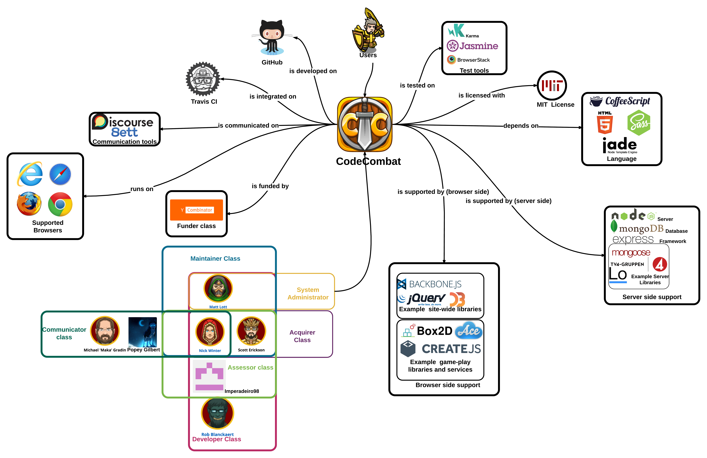
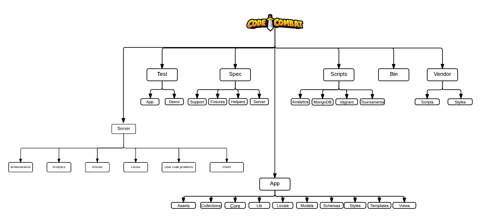

# CodeCombat: learn how to code by playing a game.
[](https://codecombat.com)

**[Maikel Langezaal](https://github.com/Maikdani), [Yu Liang](https://github.com/jessicaly), [Chengxin Ma](https://github.com/MaChengxin) and [Martijn Cligge](https://github.com/mecligge).**

_Delft University of Technology, 2016_
## Abstract

_CodeCombat is an online multiplayer game designed for users to learn how to code. 
This chapter gives an overview of the software architecture of CodeCombat by adopting multiple views and perspectives.
The system is analyzed from shallow to deep.
It starts off with some more high-level analyzes, like a feature and stakeholder analysis.
After that, a more technical analysis of the architecture has been made, like a development view and a variability analysis.
One of the findings of this analysis is that the system is well organized but lacks some standardization.
Lastly, the technical debt of the system has been analyzed.
This presented some aging libraries and inadequate documentation.
Overall, CodeCombat is a structured system with many features and it is continuously being improved by many stakeholders._

## Table of content
  - [1. Introduction](#1. Introduction)
  - [2. What is it CodeCombat?](#2.) - _The start of your coding adventure_
  - [3. Functional view](#3.) - _What functions does the system perform?_
  - [4. Who is involved?](#4.) - _The builders of the empire_
    - [4.1 Stakeholder analysis](#4.1)
    - [4.2 Power-interest matrix](#4.2)
  - [5. Context view](#5.) - _The Context of CodeCombat_
    - [5.1 System scope and responsibilities](#5.1)
    - [5.2 External entities](#5.2) 
    - [5.3 Context view diagram](#5.3)
  - [6. Development View](#6.) - _The building blocks of the empire_ 
    - [6.1 Modular structure](#6.1)
    - [6.2 Common design models](#6.2)  - _The laws of the empire_
    - [6.3 Codeline organization](#6.3) 
  - [7 Usability perspective](#7.) - _Interaction with the user_
    - [7.1 Users](#7.1)
    - [7.2 Touch points](#7.2)
  - [8. Variability perspective](#8.) - _Variability of the features_
    - [8.1 Feature model](#8.1)
    - [8.2. Features binding](#8.2)
  - [9. Technical debt](#9.) - _How well is the system implemented?_
  - [10. Conclusion](#10.) 
  - [References](#11.)
  - [Appendix](#12.)


<div id='1. Introduction'/>
## 1. Introduction

Coding is becoming more and more important in the modern day world.
Some [people](http://time.com/2881453/programming-in-schools/) even say that coding should be a mandatory class in school and most companies nowadays require their employees to have some basic coding skills.
Coding can be really useful in many situations, for example building an innovative application or solving a complex mathematical problem.

So, imagine that you are inspired by all the things you could do with coding, which options are available to learn how to code?
You could start by reading coding books and doing boring exercises, ending up scratching the head and staying up late night after night.
But if you are interested in a more fun and interactive way of learning, CodeCombat might be an option. 
CodeCombat is an online multiplayer game where people can learn how to code by playing. 
The game is set in the dark ages and the user plays the role of a knight. 
CodeCombat is created with a mission; it intends to be an integral part of the programming community where newcomers can learn how coding can be fun and programmers of higher skill level can play to challenge and expand their skills. 
CodeCombat was founded in 2013 by [Nick Winter](https://github.com/nwinter) and has more than five million active players. 
The source code of the system is publicly available via its [repository on Github](https://github.com/codecombat/codecombat).  

Four TU Delft students from the DESOSA (Delft Students on Software Architecture) group have made an in-depth analysis of the architecture of the CodeCombat system. 
The analysis is based on different architectural views and perspectives. 
The chapter starts with a feature description, followed by a functional view. 
After that, a stakeholder analysis will show who is involved in the development of the game. 
Subsequently, a context view has been made to discover the interactions between the system and its environment. 
The development view will elaborate more on the modular structure of the system while the usability perspective shows how the user interacts with the system. 
The variability perspective will show how variability is handled. 
Lastly, the technical debt analysis will describe how well the system is implemented.

<div id='2.'/>
## 2. What is it CodeCombat? - _The start of your coding adventure_

CodeCombat is a feature rich web-based game and is compatible with most mainstream browsers, such as Chrome, Firefox, Safari, and Internet Explorer. 
The game is available in multiple natural languages and is therefore easily accessible for international players. 
The user can learn six different programming languages by playing the game (Javascript, Python, CoffeeScript, Clojure, Lua, and Io).
To get started, the first thing a user has to do is create an account. 
The user can log into his personal account via its Google, Facebook, or CodeCombat account. There are different type of accounts available; there is an account type made for teachers, one for students and one for normal players. 
The students can choose of 6 different courses which can teach them specific programming skills, and teachers can manage these courses via their account. 

Now the coding journey can start! 
The player can either start playing a level created by him-/herself (Yes! It is possible to create levels by the players themselves!) or choose one from the campaign levels. 
After the level selection, a user has to choose a game character and attach items to this character, like a sword or some type of clothes. 

But how do these levels look like? 
In the screenshot in figure 1 the user interface of the game is shown. 
The game character can be seen on the left, and is controlled with the code editor on the right. 
An example of this is command `this.moveRight()` which moves a game character to the right. 
In-game settings (like the sound volume, zoom in/out, and full-screen mode) and code editor settings (like enabling autocompletion of codes) can be configured by the user.
 

_Figure 1 A screenshot of the game_

Besides playing the regular game, CodeCombat offers users the option to create their own levels and game characters. 
This is done by two features: the level editor and the thang editor. 

Users can create their own level via the level editor. 
The level editor is based on the [Thang Component System](https://github.com/codecombat/codecombat/wiki/Thang-Component-System). 
Different items (like barrels, a background, and walls) can be added to the level via the level design section. 
Additionally, scripts (defining what is happening in the level, what the goals of the level are and which programming language the user can learn), sample codes (coding hints for the code editor), so-called systems (defines how the level renders), and some other small details (like a name for the level) can be added to the level. 

To motivate user's creativity, game characters, and items (both called Thangs) can be customized via the Thang editor. 
The behavior and the characteristics of a game character (for example if a character can jump, or have certain fight strength) can be modified in the components section. 
Users can change the name of their Thang and edit the general configuration of their Thang like the color, type of body parts, sounds it makes and animations of movement. 
Lastly, users can choose to modify or create items, like a sword or shoes. 
These items can be used later while playing the game. 

<div id='3.'/>
## 3. Functional view - _What functions does the system perform?_
All of the previously described features perform certain functions. 
The functional view of CodeCombat demonstrates how the system performs these functions. 
It is expressed in the fashion of a Boxes-and-Lines Diagram.

The diagram in figure 2 shows the functional view of the system with functional elements.  
A functional element is a software code module, an application package, a data store, or even a complete system. 
Each functional element holds some responsibilities. 
The functional elements are derived from the features of CodeCombat, as seen in Table 1. 
In CodeCombat,  a functionality can be as concrete as "enlarging the editor size by a factor of 150%", or as abstract as "editing self-defined levels". 
To make the model simple and clear, functional elements in the diagram stay at an abstract level. 

| Functional elements | Feature |
|------|-------------|
| User Information System    | <ul><li>Log in</li><li>User types</li><li>Account settings</li></ul> |
| UI Language Selector    | <ul><li>Internationalization</li></ul> |
| Course System     | <ul><li>Courses</li></ul> |
| Programming Language Selector    | <ul><li>Programming languages</li></ul> |
| Level Editor    | <ul><li>Level editor-Level design</li><li>Level editor-Level script</li><li>Level editor-Sample code</li><li>Level editor-documentation</li><li>Level editor-Systems</li></ul> |
| Thang Editor    | <ul><li>Thang editor-Components</li><li>Thang editor-General Configurations</li><li>Thang editor-Item Editor</li></ul> |
| Multiplayer Mode    | <ul><li>Multiplayer levels</li></ul> |
| Game Play Core    | <ul><li>Game version</li><li>Game characters</li><li>Game items</li><li>Game campaign levels</li></ul> |
| In-Game Tweak Tool    | <ul><li>General game settings</li><li>Editor settings</li></ul> |
_Table 1 Functional elements and their features._

In the center of the diagram the core part of the game is shown, i.e. the game play function. 
This function depends on the programming language selection, user interface language selection, (optional) use of editors, in-game tweak tool, and user information system. 
Also other functions, including the course system and the multiplayer mode, depend on this game play core. 
The direction of the arrows indicates the dependency among the function elements.


_Figure 2  CodeCombat functional view diagram_

This brief overview showed that CodeCombat is a very feature-rich game with many different functions. 
Developing a game with many different features requires a diverse development team. 
In the following section, the development team of the game will be discussed. 

<div id='4.'/>
## 4. Who is involved? - _The builders of the empire_

<div id='4.1'/>
### 4.1 Stakeholder analysis

To get to know the people who are responsible for the CodeCombat project, a stakeholder analysis has been made.
The book [_Software architecture of Rozanki & Woods (2012)_](http://www.viewpoints-and-perspectives.info/home/stakeholders/) provides a handy overview to identify different type of stakeholders.
The stakeholders are identified by looking at pull requests and issues on their [Github page](https://github.com/codecombat/codecombat), and by looking at the [website of the game](https://codecombat.com/).
The complete set of stakeholders is shown in figure 3.
Some of the most important are discussed below.


_Figure 3 Complete overview of stakeholders_

#### Developers and testers
Developers and testers are the ones who develop a product/system from specifications and then test it.
Their main activities include coding and testing.

The pull request and issue analysis shows that [Imperadeiro98](https://github.com/Imperadeiro98), [nwinter](https://github.com/nwinter), [differentmatt](https://github.com/differentmatt) and [Scott Erickson](https://github.com/sderickson) are the most active developers and testers on the repository of CodeCombat.
They made and merged most of the pull requests and raised most of the issues.
But, there are many more developers and testers can be found on the [Github contributors](https://github.com/codecombat/codecombat/graphs/contributors) tab and their website (see figure 4 for Github users, and figure 3 for developers on website). 


_Figure 4 Github contributors_

#### Acquirers, accessors, and maintainers
Acquirers oversee the procurement of the system while maintainers oversee the evolution of the entire system once it is operational.
Accessors oversee the system's coherence on standards and legal regulations.

Firstly, the acquirers are [Nick Winter](https://github.com/nwinter) (CEO) and [Scott Erickson](https://github.com/sderickson) (CTO), the founders of CodeCombat.
Secondly, the pull request and issue analysis showed that the both of them are also taking care of most of the technical issues and the overall evolution of the system, so they can also be identified as the maintainers of the system. 
Lastly, the assessors are [Nick Winter](https://github.com/nwinter), [Scott Erickson](https://github.com/sderickson), and Github user [Imperadeiro98](https://github.com/Imperadeiro98).
Nick Winter focuses more on the intellectual property issues, which are a key factor in developing software projects to avoid getting involved into legal problems while Scott Erickson and Imperadeiro98 have the responsibility to check if commits on Github comply with the standards used in the CodeCombat repository.

#### The communicators and supporting staff
Since CodeCombat is an open source project, communication with the community is very important.
Communicators provide documentation while the supporting staff provides support to the users.

On Github, [Popey Gilbert](https://github.com/popey456963) edits the Wiki page of the CodeCombat repository and is therefore the main communicator.
CodeCombat provides additional documents about other information on their website and blog.
The [website](https://codecombat.com/community) and the [blog](http://blog.codecombat.com/) function both as documentation-and support tool.
Nick Winter is posting messages on this blog and Michael Gradin updates their website.
So, Nick and Michael can be identified both as support staff, as well as communicators. 

Another kind of support staff are the translators, whose responsibility is to translate the game into other natural languages.
These translations are being made most by a variety of Github users.

#### Users
The user group mainly consists of students who want to learn to code, teachers who use it as educational material, and general users who just want to play a game.

#### Others
Other stakeholders include the Funder of the project, [Y combinator](https://www.ycombinator.com/).
Competitors like [Code School](https://www.codeschool.com/) and [Codingame](https://www.codingame.com/), system administrators like [Matt lott](https://github.com/differentmatt), and suppliers like server providers. 

<div id='4.2'/>
### 4.2 Power-interest matrix
A rich set of stakeholders is the result of the stakeholder analysis.
To get a more structured overview of the set of stakeholders with their power, a power interest matrix has been made (see in figure 5).


_Figure 5 Power-interest matrix_

The stakeholder analysis showed that Scott Erickson, Nick Winter are the most important people who are responsible for the development of the game.
To get to know the environment of the game and the interactions between CodeCombat and its environment, a context view has been made (again based on  [_Rozanki & Woods (2012)_](http://www.viewpoints-and-perspectives.info/home/viewpoints/)).

<div id='5.'/>
## 5. Context view - _The relationships between CodeCombat and its environment_
Now it is time for a more technical analysis of the system! 
The context view of a system defines the relationship between the system and its environment.

<div id='5.1'/>
### 5.1 System scope and responsibilities
System scope and responsibilities of CodeCombat define what the system should do in order to fulfill its objective, 
which in this case is providing users an environment where they can learn to code by playing a game. 
As mentioned in the section of functional view, 
the scope and responsibilities of the system include the following: 
- Enabling the users to register, login, and edit their personal accounts 
- Enabling users (specifically teachers) to create classes or users (specifically students) to join classes
- Providing a forum where users can discuss the game
- Providing game related aspects (like game level selecting, game role choosing, and game coding language choosing)
- Providing different language options (Both natural languages and programming languages)

<div id='5.2'/>
### 5.2 External entities 
There are ten external entities in the CodeCombat system, and together they make up the environment where CodeCombat resides.
The ten external entities are listed below:
- Supported browsers: mainstream browsers like Chrome, Firefox, Internet Explorer, and Safari
- Developing language: [CoffeeScript](http://coffeescript.org/), [Jade](http://jade-lang.com/), [Sass](http://sass-lang.com/), and [HTML](http://www.w3schools.com/html/html_intro.asp)
- Server side support: the backend support of the system, including system server ([Node.js](https://nodejs.org/en/)), database used to store the data ([mongoDB](https://www.mongodb.com/)), the web framework ([Express.js](http://expressjs.com/)), and libraries used on the server. More details about the libraries can be found here: [Third party software and services](https://github.com/codecombat/codecombat/wiki/Third-party-software-and-services)
- Browser side support: third party software like sitewide libraries, gameplay libraries, and services (e.g. [Box2D](http://box2d.org/), a physics engine). More details about the libraries can be found here: [Third party software and services](https://github.com/codecombat/codecombat/wiki/Third-party-software-and-services)
- System testing tools: [Karma](https://karma-runner.github.io/0.13/index.html), [Jasmine](http://jasmine.github.io/), and [BrowserStack](https://www.browserstack.com/)
- Developing and maintaining platform: [Github](https://github.com/) 
- Continuous integration tool: [Travis CI](https://travis-ci.org/) (which ensures the testing of every pull request on the Github before merging)
- Communication tools: [Discourse](https://www.discourse.org/) (a forum software) and [SETT](http://sett.com/) (a high-engagement blogging software)
- License support: [MIT license](https://opensource.org/licenses/MIT)

<div id='5.3'/>
### 5.3 Context view diagram
The diagram below in figure 6 shows the context view of CodeCombat. 
The context view diagram shows the system scope and responsibilities, external entities, as well as the most important stakeholders of section 4.

_Figure 6 The context view diagram_

<div id='6.'/>
## 6. Development View - _The building blocks of the empire._
The context view showed how the environment and the interaction with the environment looked like. 
But how does “inside” of the game itself looks like? 
In other words, how is the game built, which modules are used and how are these modules developed? 
A development view (based on Rozanki & Woods (2012)) can give answers to these questions.

<div id='6.1'/>
### 6.1 Modular structure
CodeCombat is a single-page web application and consists of a client side and a server side. 
The client side follows the [Model-View-Controller (MVC)](https://nl.wikipedia.org/wiki/Model-view-controller-model) pattern using [Backbone.js](http://backbonejs.org). 
The choice of MVC results in an arhcitecture where new features can be added easily.  
The server side follows the framework provided by [Express.js](http://expressjs.com). In figure 7, a modular structure model is displayed.


_Figure 7 Modular structure of CodeCombat_

The **presentation layer** provides users with the final view of the CodeCombat web application via a graphical user interface. 
It is dependent on the lower layers in the model. 

The client side consists of three layers and follows the structure of MVC pattern. 
The **model layer** contains model components of the CodeCombat client side. 
The **controller layer** interacts with models and renders the view. 
The **view layer** is used for producing the web pages for the presentation layer.

The server side consists of two layers. 
The **route layer** determines how CodeCombat responds to client requests to particular endpoints. 
The **handler layer** consists of two modules. 
The middleware module is used for pre-processing of the requests from the clients and the handler module is responsible for processing the requests when certain routes are matched.

The **utility layer** provides utilities and configuration files that can be used in other layers. An example of such a configuration module is the config coffee module. 

Dependencies between layers are denoted by arrows in figure 7. The presentation layer has dependencies on the view layer, the controller layer, and the utility layer. The view layer produces the web pages for the presentation layer. The controller layer is responsible for rendering the view. The route layer has a dependency on the handler layer because the route layer determines how CodeCombat responds to client requests to particular endpoints, while handler layer provides functions when the route is matched. The utility layer provides support for other layers. 

<div id='6.2'/>
### 6.2 Common design models  - _The laws in the empire_
Now that it is clear how the modular structure looks like, it is important to know what guidelines maintain this structure. 
Many developers are working on the game, so some common design models are necessary to keep the structure of the system consistent.

#### Logging, Internationalization and Database interaction
The developers make use of the following levels of logging messages: `console.log`, `console.info`, `console.warn` and `console.error`. Most of the logging is done with the standards library of Javascript but at the server level, [Winston](https://github.com/winstonjs/winston) is used. 

Internalization is to implement the game in a certain way so it can easily be adapted to specific natural languages. 
CodeCombat does not want to be dependent of natural languages, and therefore uses the i18next tool to deal with translations. 

CodeCombat combines many data from the server together to form the game. 
Because users are allowed to make their own characters and levels, there is a risk that there is a data overload. 
Therefore, they use GridFS for storing this data when interacting with the database. 
GridFS stores data not into single documents, but divides it into parts or so-called chucks. 
Therefore, they can interact with their data with `Pathmetadata`, instead of interacting with a whole document.

#### Standardization of Design
The project consists mainly of CoffeeScript files, and contributors are therefore recommended to follow the [CoffeeScript Style Guide](https://github.com/polarmobile/coffeescript-style-guide). 
The guide presents a collection of best-practices and coding conventions for the CoffeeScript programming language. 
They also follow the CSS Style Guide from [Primer](http://primercss.io). 
Additional to these style guides, there are some [other guidelines](https://github.com/codecombat/codecombat/wiki/Coding-Guidelines) developed by the founders of the CodeCombat team on the CodeCombat wiki. 
For the use of third-party tools it is recommended to have a look at the currently used third-party tools and use one of these instead of adding another a new one. 

#### Standardization of Testing
Testing is something that can be really helpful in open source projects to establish a robust source code. 
Unfortunately, CodeCombat has no guidelines on testing. 
But, CodeCombat does some testing without general guidelines. 
The CodeCombat Github account is hooked up to [TravisCI](https://travis-ci.org) which runs all the server and client side tests for each commit and pull request. 
Also,  there are some third-party tools used for testing. 
The tools used include [Request](https://www.hurl.it) and [Jasmine](http://jasmine.github.io). [Request](https://www.hurl.it) is used to test query to the test server. 
[Jasmine](http://jasmine.github.io) is a behavior-driven development framework for testing CoffeeScript. 

Overall, the guidelines for both testing and design appear simple and are quite abstract. 
For a system where some many different people are working on it is important to have some standards for a consistent system design.

<div id='6.3'/>
### 6.3 Codeline organization 
Figure 8 shows an overview of the directory structure of the CodeCombat directory on [Github](https://github.com/codecombat/codecombat). 
It shows the main folder structure as well as the connections between those folders.
The app and server folders are the core of the CodeCombat application, where the server folder runs the code on the server.
* The [server folder](https://github.com/codecombat/codecombat/tree/master/server) contains many subfolders, and only some of them are shown in the figure. 
* The [folder app](https://github.com/codecombat/codecombat/tree/master/app) contains the client application source and runs in the browser of the user.
* The [folder test](https://github.com/codecombat/codecombat/tree/master/test) contains all the files used for testing. 
* Third party resources are located in the [vendor folder](https://github.com/codecombat/codecombat/tree/master/vendor).
* The [bin folder](https://github.com/codecombat/codecombat/tree/master/bin) contains the development bash utility scripts and the folder of scripts contain information of the status of the system.
* Lastly, the [spec folder](https://github.com/codecombat/codecombat/tree/master/spec) contains mostly files for testing and support. 


_Figure 8 Codeline Organization model_

Now that some more technical guidelines have been analyzed in this section, it is also important to focus on some more high-level guidelines which focus on the user interface. since many different types of users interact with the game.  
It is therefore important that the system is user-friendly, especially since younger students are working with the game. 
In the usability perspective this aspect of the system will be analyzed. 

<div id='7.'/>
## 7.  Usability perspective - _Interaction with the user_
The usability perspective states that the desired quality of a system is that it allows for an effective interaction between the user and the system. 
The major aspects that are covered include the usability and interaction of the user interface.

<div id='7.1'/>
### 7.1 Users
The type of users (as described in earlier sections) are students, teachers and programmers. 
Each user has a different level of experience. 
Most users use the system as a final product, but there are some users who make [contributions](http://codecombat.com/contribute) to the project. 
These contributions are for example designing levels and objects via the editors, or contributing to the source code on GitHub. 
Those type of users are more experienced with coding/computers since this might be a bit more complicated than just playing the game.

<div id='7.2'/>
### 7.2 Touch points
So, how should the user interface manage all these different types of user requirements? 
Firstly, because of diverse level of user experience, the systems’ user interfaces should be simple to use and easy to navigate through. Secondly,  it has to take into account the different type of users (e.g. non-students should not have to interact with the student section page).  
Thirdly, since the game is used all over the world the game should be translated into many different languages. 

To make it easier for the user to navigate to the right page the general systems user interface can be divided into three parts; the homepage of CodeCombat, the game and the editors page. 
This results in the following setup:

* Homepage
  - Account
  - Info
* Game
* Menus
  - Editor
  - Page layout
* Editors

The first user interface is the homepage (see figure 9). 
On this page, the users can easily navigate to their desired pages, namely the teacher page, the student page , and the regular player page. 
On all of these pages only very little options are available for the users. 
This results in an easy navigation for all of the users, whether they are experienced or not.


_Figure 9 The homepage interface_

The second user interface (see figure 10) the user can interact with is the in-game interface. 
This interface helps the user by pointing out where to navigate by showing a pointer to the next level. 
The most buttons in the in-game interface are straightforward, but some of them are not explained beforehand. 
This results in that the users have to figure out the meaning of the buttons themselves. 
Nonetheless, in the first level of the game a tutorial is given on how to use the system.


_Figure  10 The in-game interface with the tutorial_

The third user interface (see figure 11) the user can interact with is the editors page. 
The editors page user interface is not easy to understand for most users and therefore requires some additional reading on the wiki, or simply some trial and error. 
Furthermore, it is difficult to locate to editors page itself, since to get there the user has to navigate to the bottom of the homepage and find the small [‘community’ link](http://codecombat.com/community).
This link directs the user to the editor page. The name of this link is not straightforward and easy to understand. 


_Figure 11 The editor page user interface_

The overall concept of CodeCombat is about teaching users how to code. 
The interface of the system takes into account the variety of users by the ease of use and the thorough explanation at the first time using the game. 
Generally, the interfaces can be considered as self-explanatory, but some interfaces are less straightforward, like the editor page. 

<div id='8.'/>
## 8. Variability Perspective - _Variability of the features_ 

<div id='8.1'/>
### 8.1 Feature model
Some of the features described in section 2 of this chapter have a high variability. 
The features and their variability are displayed in figure 12.


_Figure 12 Feature model._

The model displays the _settings_ feature variability on the left side, which consists of _game settings_ and _account settings_. 
_Game settings_ mainly includes the chosen _game character_ and _items_, the _settings_ of the editor (the part of the UI where the user enters code to control the game character), and the chosen _programming language_. 
Account settings include _user type_ and _game version_. 
The game has special environments for the different user types (teacher or student) and offers a free and paid version. 

The [support homepage variability](http://codecombat.com) consists of the _internationalization_ feature (there are over 40 different natural languages available), _login_ options (Google, Facebook, or CodeCombat itself) and _courses_. 
The feature _courses_ is meant for both the teachers and students and consists of different _classes__ where various programming skills can be learned and taught.  

The [_game campaign levels_](http://codecombat.com/play) feature variation depends on the chosen level. 
As described earlier, CodeCombat works with the [Thang Component System](https://github.com/codecombat/codecombat/wiki/Thang-Component-System) (see section 2).  
Each level consists of different _thangs_ , _components_ , _scripts_  and _systems_. 
All of these items together form a level in which the user can play.

All these aspects can be modified via the feature _editors_, as described in section 2.

<div id='8.2'/>
### 8.2 Features binding
How is variability configurated? Different implementation techniques to determine the different binding times of features are discussed in this section. 

#### During compile-time binding
In CodeCombat features are implemented independently without class refinement, but rather with class extensions. 
Almost all models in the folder `codecombat/app/models/` extend from the CocoModel. 
For example, `Level.coffee` in the folder `codecombat/app/models/` focuses on the feature _GameCampaignLevels_ and extends from the class `codecombat/app/models/CocoModel.coffee`, which is also a subclasses from Backbone.Model. 
Therefore, codecombat does not hold the two compile-time variabilities, preprocessor, and feature-oriented programming.

Furthermore, CodeCombat is mainly written in CoffeeScript, which means it requires precompilation to javascript.
The precompilation can be involved with some compile-time feature binding, in which decisions are made about which files to include to generate javascript. 

#### During load-time
Load-time binding involved with command-line parameters and configuration files. 
Variations are available after compilation and before deployment. 
An example of the load-time variability of feature internationalization is implemented in server_setup.coffee file, which can be found in the repository in CodeCombat. 
The code below (figure 13) realizes the feature Internationalization according to the country code of domain name. 
For example, the language of codecombat china with country code *cn* is set to be Chinese.

```coffeescript
setupCountryRedirectMiddleware = (app, country="china", countryCode="CN", languageCode="zh", serverID="tokyo") ->
  shouldRedirectToCountryServer = (req) ->
    speaksLanguage = _.any req.acceptedLanguages, (language) -> language.indexOf languageCode isnt -1
    unless config[serverID]
      ip = req.headers['x-forwarded-for'] or req.connection.remoteAddress
      ip = ip?.split(/,? /)[0]  # If there are two IP addresses, say because of CloudFlare, we just take the first.
      geo = geoip.lookup(ip)
      #if speaksLanguage or geo?.country is countryCode
      #  log.info("Should we redirect to #{serverID} server? speaksLanguage: #{speaksLanguage}, acceptedLanguages: #{req.acceptedLanguages}, ip: #{ip}, geo: #{geo} -- so redirecting? #{geo?.country is 'CN' and speaksLanguage}")
      return geo?.country is countryCode and speaksLanguage
    else
      #log.info("We are on #{serverID} server. speaksLanguage: #{speaksLanguage}, acceptedLanguages: #{req.acceptedLanguages[0]}")
      req.country = country if speaksLanguage
      return false  # If the user is already redirected, don't redirect them!

  app.use (req, res, next) ->
    if shouldRedirectToCountryServer req
      res.writeHead 302, "Location": config[country + 'Domain'] + req.url
      res.end()
    else
      next()
```
_Figure 13 Example of source code during load time_

#### During run-time
With run-time bindings, decisions can be changed during execution time. 
Since the features implemented at run-time binding follows the same pattern set by MVC, in this section only several features have been analyzed in detail.

The feature Login enables users to sign in their user account with their CodeCombat account, Facebook account, or Google account. 
When users try to log in codecombat from browser side, the server will first load the three account selections for users. 
After the selection, the request is sent from the browser to the server to enable access token of different login methods for users. 

The feature _Game Characters_ enables users to choose a game character from various game characters. 
With requests from the users and responses from the server, users can change game characters during running time.

Now that the whole system has been analyzed, it is interesting to look at how the system is put into practice. 
This is done by looking at the technical debt. 
Technical debt is a metaphor used to describe legacy problems that need to be solved or obsolete components that needs to be updated.

<div id='9.'/>
## 9. Technical Debt - _How well is the system implemented?_

The technical debt analysis focuses on aging libraries, documentation, defects, and refactoring. The identified technical debts are as follows:

### Aging Libraries
Using aged libraries, especially no longer maintained ones, is exposing the system to risks and the vulnerability of the system will naturally increase. 
In table 2 an overview of all of the aging libraries is shown. 

| Libraries   | Version Used | Latest Version |
|-------------|--------------|----------------|
| Backbone.js | 1.1.0        | 1.2.3          |
| jQuery      | 2.1.4        | 2.2.1          |
| moment.js   | 2.5.1        | 2.11.2         |
| i18next     | 1.7.3        | v2             |
| d3          | 3.4.13       | 3.5.16         |
| Modernizr   | 2.8.3        | 3.3.1          |
| Firebase    | 1.0.24       | 2.4.1          |

_Table 2 Aging libraries_

It can be concluded that some important libraries are outdated. 
Using software like Bundler, improves the overall insight in the status of the used libraries for developers. 
Therefore, CodeCombat is strongly advised to use such a service.

### Documentation
Documentation is a great assistant to a number of stakeholders (e.g. users, developers, and maintainers). 
However, the documentation of CodeCombat is not centralized in one place and far from sufficient, because most of the documentation available describes the system very briefly.
This brings difficulty to playing, developing, and maintaining the game.

### Defects
The most easy technical debt to find is the defects in the code, which are listed on GitHub issue tab. 
Some bugs are reported more than two years ago but still unfixed, like issue [#28](https://github.com/codecombat/codecombat/issues/28) and issue [#311](https://github.com/codecombat/codecombat/issues/311). 
They indicate the presence of technical debt and need to be fixed as soon as possible.

### Refactoring
By looking at some pull request, one could conclude that CodeCombat refactors their code. 
In pull request [#1394](https://github.com/codecombat/codecombat/pull/1394) and pull request [#1379](https://github.com/codecombat/codecombat/pull/1379) rubenvereecken did some refactoring. 
This is only an example of one refactoring of code, and since there is not much discussion on the pull request, it is hard to draw a conclusion of their refactoring policy.

<div id='10.'/>
## 10. Conclusion and recommendations

The architectural analysis results in some interesting findings. 
CodeCombat is a game with many different [features](#2.) and [functionalities](#3.), which teaches users how to code by playing the regular game and also enable users to create their own content via the editors. 
The [functional view](#3.) shows that the core functionality of CodeCombat is the regular game play, which depends on various functional elements with different responsibilities. 
The [context view](#5.) shows the outside environment of the system without which CodeCombat cannot be successfully built, tested, and operated.

Many different types of [stakeholders](#4.) are involved in the development of the system. 
The most important stakeholders are the founders, [Nick Winter](https://github.com/nwinter) and [Scott Erickson](https://github.com/sderickson?tab=activity). 
They are still involved in the development of the game by merging most of the pull requests. 
There are also many contributors actively contributing to the system on the Github repository. 
These contributors all have different ways of working, which therefore require some guidelines to realize a consistent design of the system. 
The [development view](#6.) shows that although CodeCombat makes use of some design and testing guidelines, the level of detail of these guidelines could be improved. 
However, the [development view](#6.) presented also a good aspect of the system; the system's’ modular structure with a MVC architecture is well organized. 

The [usability perspective](#7.) showed that most of the interfaces are user-friendly, but the editor interface lacks some user-friendliness since the interface is sometimes messy and unclear. 
The [variability perspective](#8.) shows that features presented to the users are mainly configured in the run-time.
Furthermore, [technical debt](#9.) is another aspect that needs the attention of developers. 
Some examples of technical debt are aging libraries and inadequate documentation. 
These problems need to be solved since it would potentially bring obstacles to the development of the system.

All in all, CodeCombat is a structured project which has attracted a large amount of users. 
Developers who want to contribute to the project could focus on standardization, technical debt and the usability of some of the interfaces. 

<div id='11.'/>
## References

[1] Nick Rozanski and Eoin Woods. 2012. Software Systems Architecture: Working with Stakeholders Using Viewpoints and Perspectives. Addison-Wesley Professional.

[2] Apel, Sven, Don S. Batory, Christian Kästner, and Gunter Saake. Feature-oriented Software Product Lines: Concepts and Implementation. Retrieved on 5-3-2016 from http://link.springer.com/book/10.1007/978-3-642-37521-7

[3] CodeCombat Homepage. Retrieved on 18-2-2016 from https://codecombat.com/

[4] CodeCombat GitHub Repository. Retrieved on 5-3-2016 from https://github.com/codecombat/codecombat

[5] CodeCombat Blog. Retrieved on 18-02-2016 from http://blog.codecombat.com/

[6] CodeCombat Facebook Page. Retrieved on 5-3-2016 from https://www.facebook.com/codecombat

[7] CodeCombat Wiki Home. Retrieved on 18-2-2016 from https://github.com/codecombat/codecombat/wiki

[8] Why Basic Coding Should Be a Mandatory Class in Junior High. Retrieved on 30-3-2016 from http://time.com/2881453/programming-in-schools/

[9] Managing technical debt. Retrieved on 5-3-2016 from: https://18f.gsa.gov/2015/10/05/managing-technical-debt/

<div id='12.'/>
## Appendix

### Contributing to CodeCombat
Besides learning how to code by using CodeCombat, users can also learn how to code by contributing to it. 
This way it is possible to code coding while working on a real project and this makes CodeCombat even better.

### How to start contributing
Making contributions can be done in [several](http://codecombat.com/contribute) ways, but is mostly done by forking the Github repository and work on issues. 
Another way is by using one of the [editors](codecombat.com/editor) that are integrated on the CodeCombat web page. 
For more information about the editors it’s best to look at the [wiki page](https://github.com/codecombat/codecombat/wiki/) of CodeCombat.

Before any contribution can be made the user has to sign the [Contributor License Agreement](https://codecombat.com/cla). 
After this the user can [set up the CodeCombat environment](https://github.com/codecombat/codecombat/wiki/Archmage-Home) and start making contributions.

For working on translations for CodeCombat users can also go to the [Diplomat page](http://codecombat.com/contribute/diplomat) and go to the [translation page](http://codecombat.com/i18n) for translating the levels or select  the language they want in the list of languages to translate the interface and website. 
Selecting a language from the list brings them to the respective file for that language on GitHub, where they can edit it online and submit a pull request directly.
