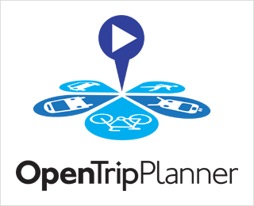
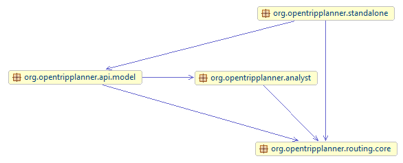
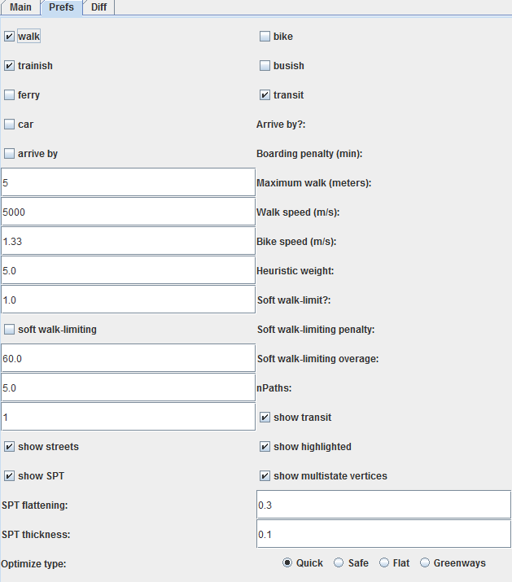
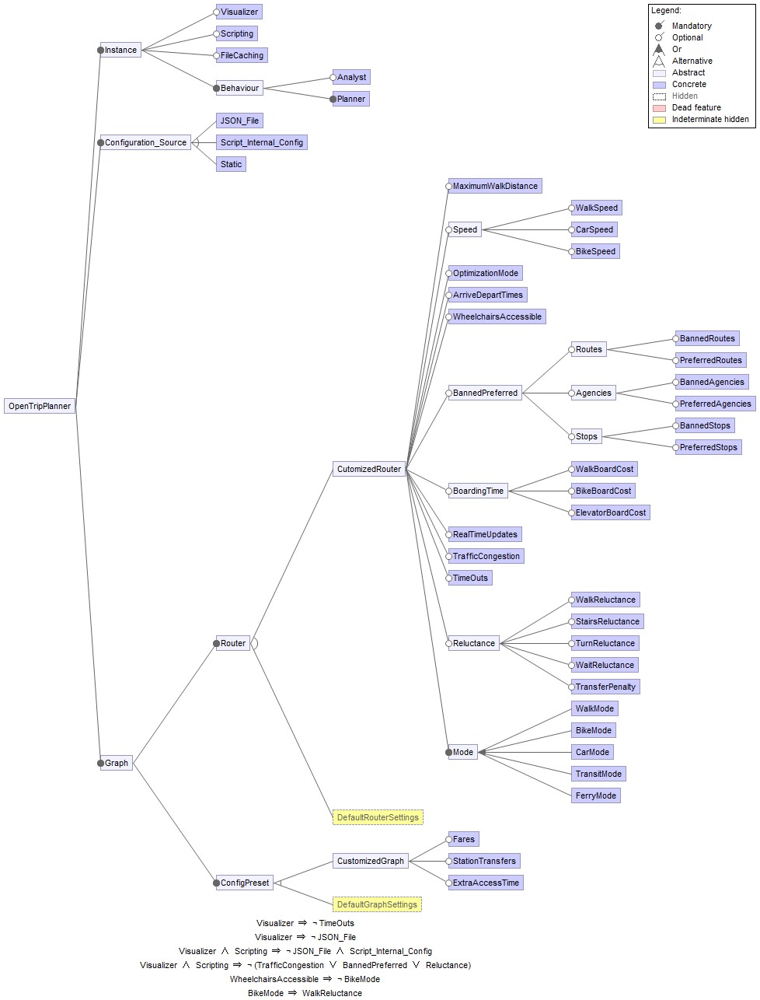

<!-- CHAPTEROUTLINE-------------------------------------------------------------- -->
# OpenTripPlanner: A multimodal tripplanner
  
<a href="https://github.com/mvandertuin">Marieke van der Tuin</a>, <a href="https://github.com/thomhubers">Thom Hubers </a>, <a href="https://github.com/ergone">Piotr Tekieli</a>, <a href="https://github.com/acroockewit">Aafke Croockewit</a>

<!-- ABSTRACT-------------------------------------------------------------- -->
##Abstract
*In this chapter, a multi-modal and multi-agency journey planner is analyzed: Opentripplanner (OTP). OTP is an open source platform, following a client-server model, providing several map-based web interfaces as well as a REST API for use by third-party applications. Users of OTP are most of the time developers of the project as well, since they use OTP to build applications and fix bugs themselves. In collaboration with one of the stakeholders of OTP, Plannerstack, contributions have been made to the project, all to add value to the 1.0.0 stable release, were developers are currently working on.*

<!-- TABLEOFCONTENTS-------------------------------------------------------------- -->
## Table of Contents
1. [Introduction](#introduction)
   - [History](#history)
2. [Who is involved in OTP?](#stakeholders)
   - [Users](#users)
   - [Contributors](#contributors)
   - [Integrators](#integrators)
   - [Plannerstack & Conveyal](#plannerstack)
3. [Context View](#context)
4. [Development View](#development)
   - [As-intended development view](#asintended)
   - [Layering violations](#layering)
   - [Technical debt](#debt)
5. [Features of OTP](#variability)
   - [System-wide features](#sfeatures)
   - [Graph build features](#gfeatures)
   - [Run-time features](#rfeatures)
   - [Relationships](#relationships)
   - [Feature model & binding time of features](#fmodel)
   - [Variability strategy](#variability)
6. [Handling of itinerary requests](#view)
7. [OTP going international](#perspective)
8. [Future releases of OTP](#future)
9. [Conclusion](#conclusion)
10. [References](#references)

<!-- CHAPTER -------------------------------------------------------------- -->
### Introduction 

OpenTripPlanner (OTP) [[4](#otpwebsite)] is an open-source software for multimodal trip planning and transportation network analysis that allow users to search for itineraries including pedestrian, bike, transit, and car components. The project is used as routing engine in both commercial and open source projects.

This chapter informs about the recent development of OTP. First, the stakeholders are examined, followed by an analysis of different views on the system. These views provide insight into the inner workings of OTP itself and its development process. The insights gained with this analysis are combined into recommendations, which can be found at the end of this chapter.

#### History 

OpenTripPlanner was created in 2009 by OpenPlans. The main user of the project was the TriMet [[7](#ttp)] regional trip planner. TriMet [[8](#tpm)] is the transport authority of Portland, USA. At the end of 2012, OpenPlans decided to stop with the development coordination. However, in the beginning of 2013 members of OpenPlans founded Conveyal, an open source focused transportation consultancy. They continued to support the OTP development.

<!-- STAKEHOLDERS --------------------------------------------------------- -->
### Who is involved in OTP? 

The history of the OpenTripPlanner [[9](#his)] has a clear impact on the stakeholders involved [[6](#sfc)]. The people involved mostly with the development of the code are employees of Conveyal [[2](#conveyal)]. Furthermore, a few local authorities that use OpenTripPlanner are actively involved in the project development. For example Ruter#, the travel agency for Southeastern Norway and HSL Finland use OpenTripPlanner in their planning tools. Not only local transport authoritie, but also some individuals are working with OpenTripPlanner. Most of them use OTP to built apps, such as AllyApp, a local transport planning application which can be used in multiple cities (mainly in Germany).

#### Users 

There are two main types of people who use the system. There are the users who built an app or website using OTP (for example HSL Finland), and there are users that extend OTP into customer-based solutions (for example PlannerStack, who provided an OTP solution for the Dutch Connexxion bus company). The latter category can be seen as providers of OTP to others. Both groups can be further categorized into developers and benefiters. Developers contribute to the project by providing new features and bug fixes. Benefiters only make use of the system. The following graph shows the users and most important involved companies according to these two dimensions (*Figure 1*).

At last the end-users have to be mentioned. The end-users will use the app, website or other solution build on top of OTP, e.g. to plan a trip. Because this group of users is not directly involved in OTP (they will never directly use OTP), they are out of scope for this chapter.

  
_Figure 1: Categorization of the users_

#### Contributors 

It's hard to make a distinction between different types of contributors. There are no explicit testers, documentation writers or maintainers. Most contributors are involved through their company or an application. The main contributors are shown below with their profile pictures, names and GitHub user names (*Figure 2*). The people of the GitHub OpenTripPlanner organization are marked with a red square. The people shown at the bottom of the picture do not belong to a larger company, but all have made an app or website incorporating OTP.

_Figure 2: Overview of the main contributors, including their companies_

#### Integrators: Andrew and Laurent 

Andrew Byrd (@abyrd) is the overall manager of OTP and acts like an integrator. He decides which new features should be added and how bugs should be solved properly in order to remain the ideas behind OTP. On GitHub he is responsible for nearly all pull request merges. His role as a manager can clearly be distinguished at issue [#2153](https://github.com/opentripplanner/OpenTripPlanner/issues/2153). He shows clear understanding of the ideas behind OTP and pushes solutions directly to the codebase. At the Mailing Lists, he does not answer questions on the normal usage of OTP, but he does read through the discussions and tries to manage the resources correctly by for example redirecting discussions towards a GitHub issue if it would better belong there ([for example at this discussion](https://groups.google.com/forum/#!topic/opentripplanner-dev/bCRtwdmUPoA)) [[3](#google)]. He also posts announcements on the Dev mailing list regarding new or deleted functions, as can be seen [at this topic on Path Parsers](https://groups.google.com/forum/#!topic/opentripplanner-dev/a-bNRJpa1cA) [[3](#google)]. If he fixes a bug himself, he doesn't use a pull request but directly pushes to the repository. This sometimes leads to discussions at issues where Andrew claims he fixed the issue, with an immediate response of some one else claiming it still does not work or a new bug appeared. Even compilation errors sneak through ([see here](https://github.com/opentripplanner/OpenTripPlanner/pull/2194))! It is remarkable that a manager of an open source project does not like to be controlled himself while requesting this from the other contributors.

#### Plannerstack ####
Plannerstack is one of the companies (actually a foundation) that is using OTP for it's projects. The developers of Plannerstack are improving OTP while using it. The foundation does also offer a hosted service in which developers can use the service without the need of a server.

#### Interests of contributors
As shown, the main developers are working for their own companies or applications. This also reflects the way developers maintain the code and add new features. Bugs are encountered by users of the system, and most of the time immediately fixed by themselves. For example, @sdjacobs reports an issue about a NullPointerException ([#2210](https://github.com/opentripplanner/OpenTripPlanner/issues/2210)) and gives the fix himself immediately afterwards in a pull request ([#2211](https://github.com/opentripplanner/OpenTripPlanner/pull/2211)).

New features do not seem to be added a lot the last month. This might be due to the upcoming release 1.0.0, the first stable release of the project. There are a few new features identified for this release though. An example of a new feature which is planned to be added is the Park and ride option. As can be read in issue [#1330](https://github.com/opentripplanner/OpenTripPlanner/issues/1330), this already has been implemented by the company GoAbout and only needs to be merged. We suppose that GoAbout needed this feature for their own project, and therefore implemented it. This seems to be the case for all new features added: they are implemented by contributors because their own application needs it. OTP can then benefit from those features built for others.

<!-- CONTEXTVIEW --------------------------------------------------------- -->
### Context View 

Its core is written in Java, therefore the application can be implemented on top of most of modern operating systems supporting JVM technology, including a variety of portable solutions. Each running instance of OTP offers a customizable web interface enabling efficient information exchange between the application's server and its users, mainly used for debugging purposes by developers. The provided API interface, on the other hand, allows more advanced users to automate their OTP implementations with scripts written with Jython or Groovy.   

The development of OTP relies on the concept of open-source, both in terms of application's code, as well as implemented data standards. General Transit Feed Specification (GTFS) providing schedule data of public transportation, OpenStreetMap (OSM) delivering information regarding street networks of particular zones, and NED tiles for assuring that the digital elevation model is applied to an active map, are the examples of such, which successfully substitute their commercial counterparts. The main distribution of application's source is realized by GitHub, which additionally allows an efficient publication and management of software related issues and associated pull requests, carrying potential changes to the project proposed by developers or community itself. The remaining project's documentation has recently been outsourced to an external website associated with project's main domain [[5](#otpdoc)]. To allow better understanding of that concept, we have depicted these relations on the graph below (*Figure 3*).

  
_Figure 3: Context View of OpenTripPlanner_

<!-- DEVELOPMENTVIEW --------------------------------------------------------- -->
### Development View 

This document gives an insight into the development process and architectural structure of OpenTripPlanner (OTP). In the first chapter, a description of general development process can be found. Consequently, a development view is presented, and followed by some violations of this as-intended perspective. The next paragraph focuses on the presentation of dependencies that are used in OTP project. The document is concluded with an insight given on technical debt (or design debt) of the aforementioned system.

#### Development of OpenTripPlanner ####
OpenTripPlanner uses Maven for building the project and managing its dependencies (the detailed information regarding them is located in the following paragraphs). It can be easily developed with the use of IDEs (Integrated Development Environment) such as Eclipse, IntelliJ or Netbeans. In case someone is willing to contribute to the project, the developer's mailing list and the GitHub repository can be used as a starting point for the process. OTP incorporates the aforementioned mailing list mainly for modification proposals and decision processes. GitHub, on the other hand, is used as the main code repository, place for publication of functionality issues and the maintenance of documentation. Although the guidelines specify that each commit should be based on a certain issue [[10](#dev)], this does not happen very often in practice. Most Pull Requests are correctly linked with the corresponding issue, but direct pushes of commits do not usually refer to them (defined issues) (e.g. [this commit](https://github.com/opentripplanner/OpenTripPlanner/commit/53658c9797aac1656f2681255d3bea42a86b1d55)).

The project uses the same coding conventions for Java, as those that are included in GeoTools, which reflect a minor variation on the Sun coding convention. This convention is a way of formatting code and can automatically be set and utilized in any IDE which supports the import feature of the formatter.xml file (such as Eclipse). This file is positioned in the root folder of the project's repository. Furthermore, the development of JavaDoc is required for all new methods, classes and fields. All testing components are written with the use of JUnit.

The code itself is structured neatly. The codebase is split into four main parts: **client** which provides user's interface, **main** including all Java code for processing all requests and responses, the scripts which can be used to run OTP with a default set of parameters, and **tests** which provide the aforementioned testing modules for the main code. The utilization of of Java packages within **main** and **test** parts is correct and well justified, which reflects the sign of prior thorough planning and consideration of design decisions. Some packages include a separate package-info file, explaining what the package is responsible for and which other packages are related to it. The testing part reveals the exact package structure as the one spotted during the analysis of the core, which makes it easy to find the corresponding tests for certain classes and methods.

#### As-intended Development View 

OpenTripPlanner operates in two modes: as an instance running via Grizzly server (web server), which is suited for planning trips, and an analyst mode in which the complete network can be analyzed. Both of them refer to the same core: a routing Java library which is responsible for computing the multi modal transport trips. On top of this core, several services are built which call its internal functions [[11](#ua)].

Here are presented the two of them that are used on a daily basis. The first one is Routing API, a RESTful (REST is Representational State Transfer) web service which responds to journey planning requests. This, with the an appropriate mapping library can form a friendly web GUI (Graphical User Interface) that provides basic planning features. The other one is Script API, that introduces users the ability to create automation mechanisms and functions for OTP with the use of their favorite scripting language. At that moment only a limited number of these is supported.

The Analyst can be executed in two configurations: the basic Analyst and the Batch Analyst. The basic Analyst Web Services provide basic network analysis results, while the Batch Processor handles more complex examination tasks. It allows an implementation of very open-ended configuration, which includes, for example, an information regarding terrain's population rates and therefore provides a powerful tool for visualizing how transport networks affect access to urban facilities. Both the Analyst and Batch Analyst do not make use of services, but rather directly call methods inside the core.

When it comes to the core itself, it incorporates two separate services for its proper functionality: OTP Transit Index API and Graph Builder. The Transit Index delivers information to the core, recovering them from GTFS files, which specify routes, stops and frequencies of all transit lines. The Graph Builder composes graphs from available OpenStreetMap (OSM) databases, which handle open source geographical data. These are created mostly by community and available to anyone, who is willing to utilize them.

Additionally, the Graph Builder can be invoked by OTP instance via Graph Visualizer. This component provides a basic interface for recovering edges and vertices's metadata.

A visualization of the as-intended development view has been composed according to the prior description and depicted on the graph located below (*Figure 4*).

  
_Figure 4: As-intended development view of OTP_

#### Layering violations in OTP 

Although OTP seems to have a clear layering approach among the packages, where the instance invokes core function utilizing several APIs for that purpose, this matter is sometimes violated.  

The example of such violation can be observed while the OTP Instance directly calls the core to create a new RoutingRequest parameter configuration, which sets available modes and speed limits. We suspect that those are probably set before the actual execution of call, since different modes require different start-ups of the core itself. All other parameters are correctly set using the Routing API.

Furthermore, it would seem logical in the structure if the Analyst also used APIs to communicate with the core. However, this is not the case here, since the Analyst always directly invokes the core. What seems to be an even larger violation, is that the Router API uses constructs defined in Analyst, for example a PointSet (a group of destinations). A neater solution would involve creating a service which defines such constructs, which is called by both the Analyst and the Router API.

The identified violations are shown on a package dependency graph place below (*Figure 5*).

   _Figure 5: Example of Layering violations in OTP_

### Technical debt in OTP 

To identify if there is technical debt in the system, the OTP project is evaluated in terms of the following 7 points [[12](#points)]: slowing velocity, stressful releases, aging libraries, defects, low automated test coverage, poor score on code quality metrics, presence of code smells

**Slowing velocity**  

> Slowing velocity is the measurement for how much work a development team can complete during a particular interval. If the velocity starts to slow down, it can be a sign of a technical debt.

Since the beginning of 2016 there are not many contributions done to the master branch. Although, for establishing the conclusion that inactivity could be a sign of technical debt here, is probably too soon. To justify that, we would like to mention that in 2015 the project was provided with many contributions. Besides, the same situation happened at the end of 2014, after which the project became active again. Additionally, about 10 PRs have already been merged to the master this month. All of them were provided by several different developers.

**Stressful releases**  
> The stress at the end of a release cycle indicates an occurrence of a possible technical debt, which impairs the development productivity.

On [Google Groups](https://groups.google.com/forum/#!searchin/opentripplanner-dev/release) and [docs.opentrippplanner](http://docs.opentripplanner.org/en/latest/Changelog/) there is clear communication about new releases. The releases seem to be strictly controlled (in a good manner) mostly by Andrew Byrd, who takes the responsibility for these actions. The goals that are set are concrete and realistic, which prevents against slipping into crunch mode  [[13](#crunch)].

**Aging libraries**  
> The usage of outdated libraries shows technical debt.  

OpenTripPlanner uses Maven, which is a combined build and dependency management system: it fetches the external libraries that OTP uses, runs the commands to compile the OTP source code, performs tests, and deploys the executable JAR-file into the repository.

For example as a test framework [Junit](http://mvnrepository.com/artifact/junit/junit) version 4.8.1 is used. This version is from December 2009, which is also the same date when OTP was released. This means that multiple new versions has already been released since. This reveals the technical debt. Other examples are: slf4j version 1.7.6 (February 2014), logback-classic version 1.0.13 (February 2013) and flexjson version 2.0 (2010), while newest version was released in 2014. This means for OTP there is a possible improvement to be done in the sphere of maintaining these aging libraries.

**Defects**  
> A high number of open or escaped defects is an indicator of technical debt. 

OTP has 629 [open issues](https://github.com/opentripplanner/OpenTripPlanner/issues?q=is%3Aopen+is%3Aissue), which is quite a lot, compared to 1121 that has already been closed. However, of those 629, only 62 are so-called bug issues. Issues are added roughly once a month.

The data usage in OTP for the Netherlands and New York requires a different mode, namely long-distance mode (instead of classic mode). One of the key differences in long-distance mode is the elimination of the following requirement: non walking segments of a trip could occur not only at the beginning and end of a trip, but also at transfers. Many months have been spent on ensuring this requirement is met, and it has interfered with the implementation of new routing algorithms more than once. This clearly shows that some knowledge was not there yet in earlier phases of the project. In this case OTP should deal with bike transit. This is fitting what Ward Cunningham [says](http://c2.com/cgi/wiki?WardExplainsDebtMetaphor) about technical debt: “I am in favor of writing code to reflect your current understanding of a problem even if that understanding is partial. Technical debt is a knowledge deficit."

It took a long time (“..many months have been spent..”) to implement the improvement, according to AByrd on [Google Groups](https://groups.google.com/forum/#!searchin/opentripplanner-dev/longDistance%7Csort:relevance/opentripplanner-dev/32XP6zxTzG4/lD-uekkruxUJ).

**Test coverage**  
> The test coverage of OpenTripPlanner was tested using the tool EclEmma.  

The overall test coverage of OpenTripPlanner is 55%, which is quite low. But the Routing package which contains all routing algorithms, has a test coverage of 75%, which is pretty good. The other main packages used by the core of OpenTripPlanner, GTFS and OpenStreetMaps, have a coverage of 84%. The test coverage for OTP as a whole is good enough.

OpenTripPlanner uses a continuous integration sever. Every time a Pull Request is submitted or a change pushed, this server will compile and test the new code. In this way, the code is continuously tested and not accidentally broken by a new commit. Therefore, concerning the testing no technical debt occurs.

**Poor score on code quality metrics**  
The left side of the pyramid (*refer to figure 6*) shows the size and complexity of the system, showing a high rate for the number of methods. This means there is room for improvement for the number of methods and for the length of the methods.
  
_Figure 6: Code quality of OTP_

**Presence of code smells****
With Infusion Metrics the code smell is analyzed.
OTP has 133.099 lines of code. The system has 360 Design Flaws and the QDI is 36,9 (*see figure 7*). ([The Quality Deficit Index](https://dzone.com/articles/jsf-component-libraries) is a positive, upwards unbound value, which is a measure of "badness" of the analyzed system's design quality respecting the overall size of the system.)
  
_Figure 7: Presence of code smells_

Concluded can be that OTP project has technical debt (aging libraries, code quality metrics and defects), but most of it is managed [[14](#managed)]. Meaning releases are stable, not rushed and existing debt is paid off if needed. Fore example the defect for low-distance mode (issue 268) illustrates this: it was created in 2011, and fixed only recently.

<!-- VARIABILITY VIEW --------------------------------------------------------- -->
### Features of OTP 

OpenTripPlanner has several different features, of which some are especially created for the developers (for example for debug purposes), some especially for application builders and transport authorities (for example setting the fares) and some which are built for the users (for example setting the maximum walk distance). These features can be configured using JSON files (JavaScript Object Notation).

#### 1. System-wide features 

System-wide features affect the entire OpenTripPlanner instance. They are used to start OpenTripPlanner in a certain mode, for example Analyst or scripting. The system-wide features will mainly be used for development and debugging of OpenTripPlanner.
They require a rebuild of the instance when changed. They can be changed by giving different parameter flags on start-up at the commandline, or by specifying a separate configuration file `otp-config.json`.

#### 2. Graph build features 

The Graph build features require a complete graph rebuild if they are changed. They can be specified in `build-config.json`. They specify options which should not be changed by the user of the application itself, for example transit fares. Application builders or transport authorities can use the Graph build features to change certain parts - for example a change in the fares - without any need to restart the complete application. This is useful since a restart of the application might require quite some time due to the time consuming loading of data. Typically, this will be done a few times per year in a running application.

#### 3. Run-time features 

A geographical area with specific services is called a router. OpenTripPlanner can deal with several routers at the same time. The configurations can be set per router, at run-time. These can be specified in a separate `router-config.json` file, but most of the time the user interface will provide options for changing them. The run-time features include user specific settings, such as modes to use and maximum walking distance.

#### Relationships 

Several relationships can be found between the features.

- If a certain **Mode** is not selected, the accompanied options are not taken into account, such as **Fares**, **Speeds** and **Boarding time**.
- If cycling is added as a selected **Mode**, walking will be added automatically as well, with a high **Reluctance** for walking. This was implemented to model walking next to your bike, which might be needed to reach a walk-only accessible area.
- If **Wheelchair accessibility** is selected, non-wheelchair accessible **Mode** settings will not be used, for example cycling.
- If the **Visualizer** is started, the options which are set in the JSON files will not be used. Part of the options can be selected in the visualizer itself by selecting checkboxes in the user interface, as can be seen below (*figure 8*).

  
_Figure 8: Variability options at the Visualizer_

- If the **Visualizer** is started, any **Timeout** settings are neglected due to search animations
- If **Scripting** is used, the run-time features should be specified in the script itself instead of using the JSON file. Furthermore, not all options are available, for example the set of **Preferred routes**, **Congestion** and **Reluctance**.

#### Feature model & binding time of features 

As it can be observed, the before mentioned list has been created and divided accordingly to the binding times of specific features. In this particular software, most of them can be selected or altered during run-time with the use of GUI or CLI commands. Those which cannot be configured that way are usually defined as starting parameters for each OTP instance. The analysis of source code has not revealed any compile-time bounds or features that could personalize each build.
The graph located below (*figure 9*) depicts a simplified view on the structure of listed features along with their dependencies and logical constraints. The reason for this simplification lies within the complexity that is introduced with each presentations of detailed architectures. In order to make this graph feasible for further analysis, and understandable to each stakeholder, this level has been set to be optimal, meaning - without additional elements that has not been described in the prior parts.

  
_Figure 9: Feature model of OpenTripPlanner_

#### Variability strategy 

As can be read above, OTP is not very variable. There are a lot of options which influence the routing mechanism, but it's hard to see those as different software versions, since none of them are configured at compile-time or can personalize a certain build. There are some different operational modes: normal, script and analyst. These do all provide a different subset of the features of OTP and can thus be seen as variants. But those different modes are never being shipped separately and a big part of the code base is being used by all modes.

The strategy to cope with variability can be summarized as trying to have as less variability as possible. The variables (routing parameters) described above are managed by configuration files. These files are formatted in JSON, which makes the configuration structured and easy readable by both humans and computers. The software reads these files and applies the settings on its working. This mechanism makes the variability manageable, because the source code doesn't need to be adjusted for each variety in functionality. The fact that the configuration files are shared across the different operation modes does also improve the manageability of the different features.

One exception to this solution however, is the way that options are covered in the Graph Visualizer. The visualizer has its own configuration section with a subset of the options of OTP. That this fragmentation reduces manageability can directly be seen, since the layout of this panel is broken since a recent update.

#### Evolution history of variability mechanism 

The way variability is handled within the OTP project has not been changed so much in the last years. Configuring route planning software with configuration files is a common way to do this and the people who built the software chose this mechanism at the beginning of the development. Since it's working very well and ensures a good manageability, this mechanism is not likely to change a lot in the coming versions. A good next step might be that the current approach is used by the whole system and that exceptions like the Graph Visualizer will be removed. This improves clarity and manageability.

<!-- ANOTHERVIEW --------------------------------------------------------- -->
### Handling of itinerary requests 

Dealing with itinerary requests is the main functionality of OpenTripPlanner. To give more insight on the internal handling of these requests, a functional view was created for this purpose (*see figure 10*).

  
_Figure 10: Functional View of OTP, showing how a request is handled_

A user provides his requests by specifying the origin, destination and preferences at the webbrowser. This request is send via the RESTful webservice to the OTP instance. A routing request is handled by the Routing Core module. The core creates a separate Routing Context for each routing request. This context includes the user input and other parameters, as well as the graph and transit feeds. If requested, the real-time feeds for transit and historical data on traffic speeds is included in the Routing Context as well. The Context is then given to the PathFinder. The PathFinder is responsible for actually searching possible routes from origin to destination. This is done by applying the A star algorithm. Several heuristics are used in this algorithm to speed up, depending on the type of request. This leads to a ShortestPathTree with the discovered itineraries. From this list the itineraries are taken that actually arrive at the wanted destination, also called States. These are banned by the PathFinder from the considered paths for the next searches, to create more variety in the found routes. The PathFinder continues iterating until a  certain time limit is reached or the number of paths found is sufficient. Next, the found paths are returned to the user.  

<!-- ANOTHERPERSPECTIVE ----------------------------------------------- -->
### OTP going international 

The rapidly growing interest in digitalized solutions, including software and hardware, can nowadays be observed all around the globe. One of the keys to such a product's success lies within its ability to perform efficient communication with its end-users through simplified and localized interfaces. Translation is a very important factor, appealing to potential customers to buy the product or application, once it tries to enter and win the market. Despite being an open source project, the OTP is equipped with a convenient and easy mechanism for providing support of new languages. Our analysis has shown that a couple of localizations already exist, in most cases done by contributors from Europe. Following this trend, decided was to include the support of one, new language - Polish - which is designed to become a decision-driving factor for companies which originate in that country, but still hesitate on whether to choose this product or switch to commercial competitors.

The translation process of the web interface was conducted in accordance to instructions included in an official guide written by OTP developers. The first step was connected with re-using a dedicated translation template with English phrases as a base for new localization files. This was done with the help of POEdit software, which is a good solution for the manipulation of gettext (i18n) content. Since the software uses JSON structures for its provision of support for various languages, the files were converted and saved in the desired format. The last step involved the adjustment of the representation of units, and date / time formats, that were the most suitable for the newly generated localization. The graphical representation of the following steps in this process is included below.

  
_Figure 11: Brief overview of the translation process_

The OpenTripPlanner project still has a long way to go, in order to become fully internationalized software. Right now, thanks to the implementation of GNU Translation Project (gettext), the program is able to efficiently support the vast majority of today's languages. Unfortunately, those, which include horizontal or pictographic representation of letters, have still not qualified to join this group. The reason for that lies within the "fixed-designed" interface, that do scale up to delivered content. The changes in code are required, in order to make it happen. However, considering that OTP's nature belongs to the open source world and there are many participants willing to actively develop it, this case is more than possible to achieve, even in the near future.

<!-- FUTUREOFOTP --------------------------------------------------------- -->
### Future releases of OTP 

#### 1.0.0
This release version was originally planned for the end of 2015, but the authors did not accomplish to make this deadline. The development is slowed down because of a lack of attention of the main contributing companies. Several bugs still need to be fixed before this version can be released, but according to Plannerstack this release will be published soon. Andrew Byrd (main developer) is working hard on finishing the release, that’s why external contributions are merged very slow.

#### 2.0.0 (R5)
This release is mainly the cause of 1.0.0 being delayed. This release (nicknamed R5) incorporates a new routing engine (Bliksem). This engine is well optimized and written in C, but lacks features like real time data and traversal permissions. When this version is done, the source will be published. Bliksem, R5 and OTP share the same REST API for interoperability.  A lot of attention is paid to this release which is also being scheduled to be published soon. This version is being built by Conveyal.

<!-- CONCLUSION --------------------------------------- -->
### Conclusion 

OTP is an interesting project because it’s both commercial and open source. This means that there is a community that is involved in maintaining and improving the code, but this community is small at the same time. The authors are not very clear about their intentions regarding the future of the software. From a technical point of view, the project works quite well. Although the routing engine has some bugs, none of these are show stoppers and the project is used in some important trip planners.

If the project owners want OpenTripPlanner to become a lively open source project, it is recommended that they are more open about their goals for the future and involve the community in discussions about release schedules and features. Direct undiscussed commits to the master branch are not recommended. But it’s hard to keep a community involved and deliver software to clients at the same time.

<!-- REFERENCES --------------------------------------------------------- -->
### References 

1. 
 Rozanski, N. & Woods, E. (2012). *Software systems architecture : working with stakeholders using viewpoints and perspectives.* Upper Saddle River, NJ: Addison-Wesley.
2. 
 Conveyal Consultancy Official Website 'http://conveyal.com'  
3. 
 - Google Groups Mailing Lists 'https://groups.google.com/forum/#!forum/opentripplanner-users'  
4. 
 OTP's Official Website, 'http://docs.opentripplanner.org/en/latest/'  
5. 
 OTP's Documentation, 'http://docs.opentripplanner.org/en/latest/Deployments/#opentripplanner-deployments-worldwide'  
6. 
Software Freedom Consservancy (SFC) Official Website 'http://sfconservancy.org/'  
7. 
Trimet Trip Planner (https://ride.trimet.org/)  
8. 
 Trip Planner by Municipal Transport Company of Valencia 'http://www.emtvalencia.es/geoportal/?lang=en_otp'
9. 
 http://www.opentripplanner.org/blog/2013/11/22/otp-joins-sfc/
10. 
 http://docs.opentripplanner.org/en/latest/Developers-Guide/#contributing-to-the-project
11. 
 http://docs.opentripplanner.org/en/latest/#basic-otp-architecture
12. 
 https://18f.gsa.gov/2015/10/05/managing-technical-debt/
13. 
 http://chadfowler.com/blog/2014/01/22/the-crunch-mode-antipattern/
14. 
 http://verraes.net/2013/07/managed-technical-debt/
